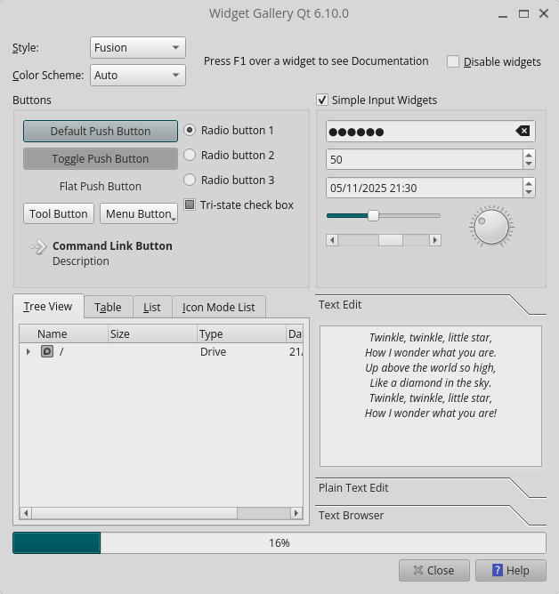
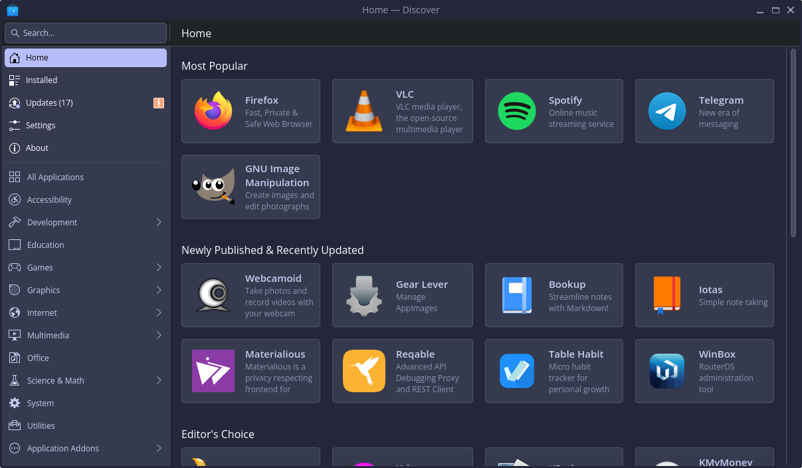

# CuteCosmic

Plugins to the Qt toolkit that help make Qt (and KDE) applications look and feel more at home in the COSMIC™ Desktop environment.

Currently consists of a Qt Platform Theme plugin.

> [!IMPORTANT]
> CuteCosmic is still experimental, but should already work reasonably well. Advanced users are encouraged to test it and [report any issues](https://github.com/IgKh/cutecosmic/issues).

> [!NOTE]
> This is an unofficial project and is not in any way affiliated with or endorsed by System76, Inc.

## Features

The following configuration is relayed from COSMIC settings to Qt applications:

- [x] Dark mode
- [x] Per-application dark mode override
- [x] High contrast mode (Qt 6.10+)
- [x] File dialogs
- [x] Icon theme
  - Including symbolic icon re-coloring to avoid dark-on-dark icons
- [x] Fonts
- [x] Color palette[^1]

[^1]: Requires enabling the toolkit theming option in COSMIC settings. Most KDE applications require a restart after theme change.

## Sounds good, but how does it look?

The Qt Widgets Gallery example with the default COSMIC Light theme, Fusion style and the Pop! icon theme:



KDE Discover rocking the COSMIC version of the [Catppuccin](https://github.com/catppuccin/cosmic-desktop) Macchiato Lavender theme with the Breeze style and icons:



## Installation

CuteCosmic must currently be built from source. To do so, you'll need a C++ compiler, the most recent Rust stable compiler, CMake and development files (headers, libraries and tools) for Qt 6.

The project aims to support only the last three released minor versions of Qt, as well as the most recent Qt 6 LTS series (if it is not one of the three). Currently this means Qt 6.8, 6.9 and 6.10.

> [!IMPORTANT]
> CuteCosmic must be built and installed separately for each installation of Qt you have. Some applications (like Qt Creator) may ship with their own installation of Qt, in addition to the system wide installation. Please also be aware that applications distributed in self-contained packages (AppImage, Flatpak, etc) also have their own Qt build, which can't be easily extended.

> [!IMPORTANT]
> CuteCosmic makes extensive use of private Qt APIs that are outside the scope of Qt's normal compatibility guarantees. If you update a Qt installation for which CuteCosmic was built (including patch releases), it **MUST** be re-built to function properly.

To build and install use a regular CMake invocation like this:

```bash
  cmake -S . -B build -DCMAKE_BUILD_TYPE=Release
  cmake --build build -t install
```

You may need to add `sudo` to the last command if building against a system-wide Qt installation. For building against a specific Qt installation, use the path to its specific `qt-cmake` wrapper script instead of `cmake`.

## Usage

If installed correctly, CuteCosmic will automatically be loaded and used when working from inside a `cosmic-session`.

You can force its' usage with the `QT_QPA_PLATFORMTHEME` environment variable, e.g:
```bash
QT_QPA_PLATFORMTHEME=cosmic /path/to/a/qt/app
```

If not working, troubleshoot by setting the `QT_DEBUG_PLUGINS` environment variable and watch the log traces to see if `libcutecosmictheme.so` is available and loaded.

## Configuration

Most of the configuration is done using the options already present in the COSMIC Settings application.

CuteCosmic will by default use the Breeze widgets style engine if installed, or the built-in Fusion style otherwise. If you want it to use another style by default (e.g. Kvantum), you can set the `CUTECOSMIC_DEFAULT_STYLE` environment variable in your profile.

## Contributing

Issue reports and code contributions are gratefully accepted. Please do not send unsolicited Pull Requests, please first propose patch ideas and plans in the relevant issue (or open an issue if one doesn't already exists).

## License

Copyright 2025 Igor Khanin.

Made available under the [GPL v3](https://choosealicense.com/licenses/gpl-3.0/) license.

## Prior Art

Other third party Qt integration plugins:

- [KDE Plasma](https://invent.kde.org/plasma/plasma-integration)
- [LXQt](https://github.com/lxqt/lxqt-qtplugin)
- [qt6ct](https://www.opencode.net/trialuser/qt6ct) (Generic)
  - [KDE Patches](https://aur.archlinux.org/packages/qt6ct-kde)
- [GNOME](https://github.com/FedoraQt/QGnomePlatform/)
- [Liri](https://github.com/lirios/qtintegration)
- [Haiku](https://github.com/threedeyes/qthaikuplugins)
